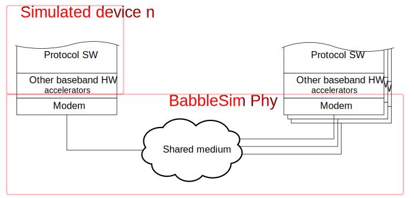

### A Phy layer simulator

BabbleSim is a simulator of the physical layer of shared medium networks.

Its main objective is to be an aid to develop network protocols and network
devices, and to be able to develop, debug and regression test target code
in a controlled environment.

BabbleSim's Phy layer simulation is, by design, meant to support very
heterogenous devices and methods to simulate or run real devices code.
In a simulation, a device may be as simple as a python script, or as
complex as a simulated multi processor system with a multitude of peripherals.

Completely different types of devices may be run together and communicate
in a simulation over a given Phy.
BabbleSim allows this by setting almost no requirements on the way the
rest of the device is simulated.
For a device to be able to run in a simulation all it needs is to relay
to the BabbleSim Phy its transmissions and reception attemps.
More details on the [BabbleSim architecture can be found here](architecture.md)

Different types of shared medium have different Phys. For ex. BLE radios,
over the 2.4GHz ISM band, use the 2.4GHz Phy (TODO: add link to 2.4 Phy)

In a simulation, several devices are run together with one Phy for each
type of shared medium (A shared medium being, for example, the 2.4GHz band).
A device is, in general, a network device (for ex. a phone, a wireless headset,
an interferer...).
The Phy is the process which:

* Emulates the channel and modem (analog and digital demodulation)
  for each of the devices
* Handles the devices coordination in that medium.

Phy-device interface

### BabbleSim is fast

All components of the simulator are designed to run fast, to allow
to run long system level simulations with multiple devices in short
time. The execution speed limit is set by the devices execution time.
The Phy and channel emulation overhead are quite minor: Simulations
with a few simple devices with BLE like activity will run in the order
of 100x-1000x faster than real time in a modern computer with the 2G4_phy

### BabbleSim is modular

By its nature, BabbleSim is highly modular. Reflecting this modular
approach, BabbleSim is organized in a set of separate git repositories.
In general one fetches and builds only the repositories/components one
is interested on.
In BabbleSim a component is understood as a device, phy, or library, which is 
typically placed in the `components/` folder.

[The BabbleSim GitHub repositories can be found here](https://github.com/BabbleSim).
Typically all users will fetch the base repository. (TODO: link to the base repo)
For more information on how to fetch the different components, please
see [here](fetching.md).

### It is easy to debug any device

By design, the Phy will wait for any device and block other devices
when neccessary.
That means that you can run any device (or several of them), in a
debugger or instrument them without affecting the simulation results.

### Folder structure

[Here](folder_structure_and_env.md)
you can find both the recommended folder structure, as well as
how to work with offtree components.

### How to use

The best way to understand how to use BabblEsim, is by trying it.
Please follow the instructions in here(TODO Add link to 2G4 usage example)
for an example using the 2.4GHz Phy.

### What BabbleSim includes

To ease implementation and to allow developing consistent devices,
BabbleSim incudes a set of optional libraries which provide
functonalities like tracing, results dumping, command line argument
parsing, random number generation, etc.

A set of simple debug aid/ancillary devices are included in the base
repository (TODO add link to base repo).

A full list of the currently provided components can be found here
(TODO add link)

Even though BabbleSim does not set how the CPU is emulated
(if at all), or how the HW should be modelled, the BabbleSim GitHub
organization does contain a git repository with models of the NRF52 HW.
(TODO: add link to it)
These models can be used together with the 
[Zephyr's](https://zephyrproject.org) nrf52_bsim board (TODO: add link)
to execute Zephyr and use BabbleSim's phy to simulate the communication
over the 2.4GHz ISM band.
A quick guide on how to get this device up and running can be found
here (TODO add link).

### Design choices

This is BabbleSim's list of [design choices & objectives](objectives.md)

### License and contributing to BabbleSim

[Here you can find our contribution guidelines and an introduction to BabbleSim license](contribution_guidelines.md)